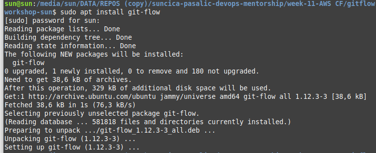
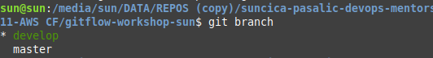
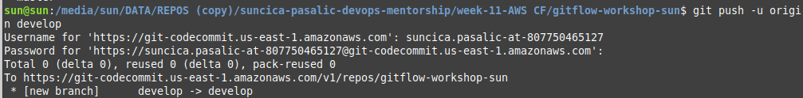
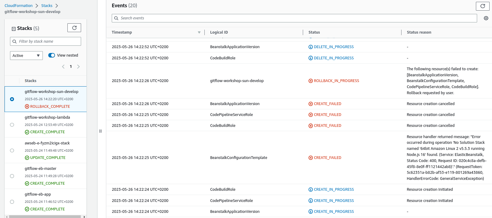
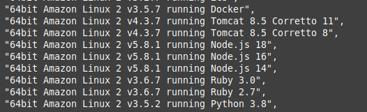
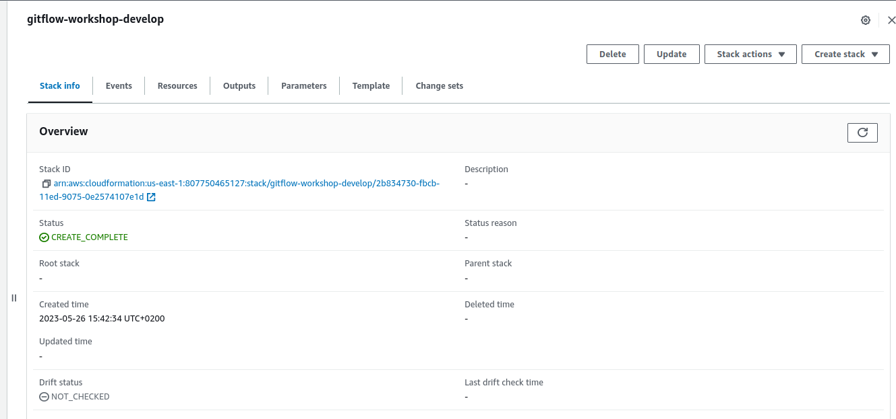

## Create Develop Branch

When using the git-flow extension library, executing git flow init on an existing repo will create the develop branch:

1. Initialize gitflow

Install git-flow locally

Intialize git-flow

2. List the current branches. The current branch will be highlighted in green and marked with an asterisk.

        $ git branch

3. Push commits made on a local branch to a remote repository.

        $git push -u origin develop

User need to be on the branch develop to push changes on develop branch. 

## Create Development Environment

After pushing the commits to development branch, the lambda function you created earlier will automatically detect a new develop branch created and codecommit will trigger the function to create the development environment and code pipeline.

Before this, it was error: 

a) Used command to list available solution stacks: 

        aws elasticbeanstalk list-available-solution-stacks

    Result: 

After trying to change version od Node.js on 16 editing encreate.yml and push it on master branch on CCommit it was not possible to create gitflow-workshop-develop branch. Instead of this, it's used manually step, using command: 

    aws cloudformation create-stack --template-body file://envcreate.yaml --parameters file://parameters-dev.json --capabilities CAPABILITY_IAM --stack-name gitflow-workshop-develop

 
Results: 

