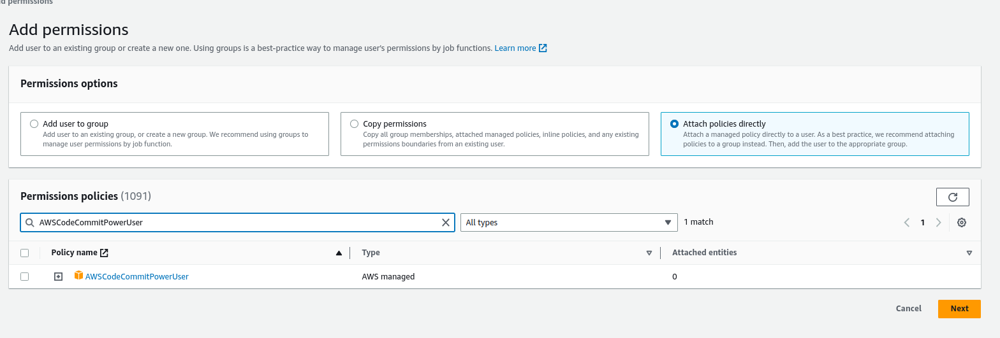
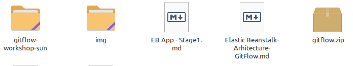
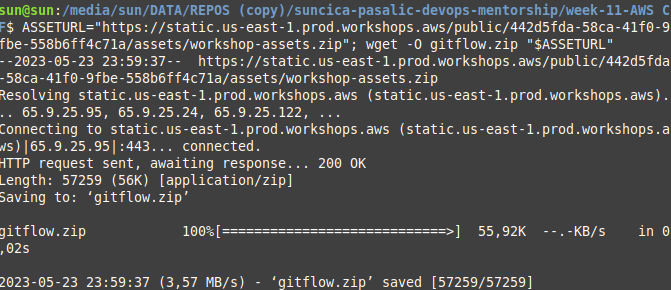
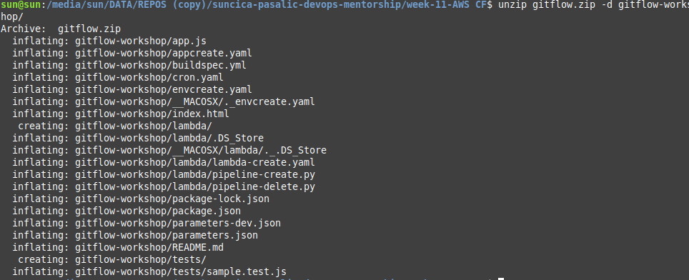
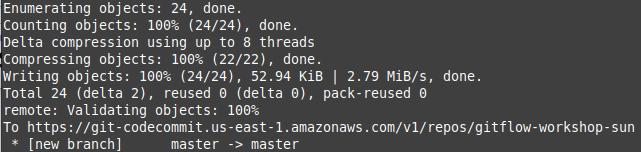
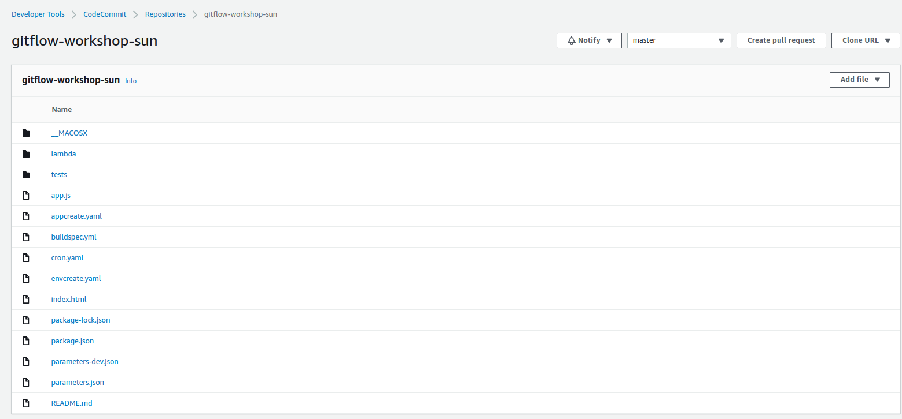
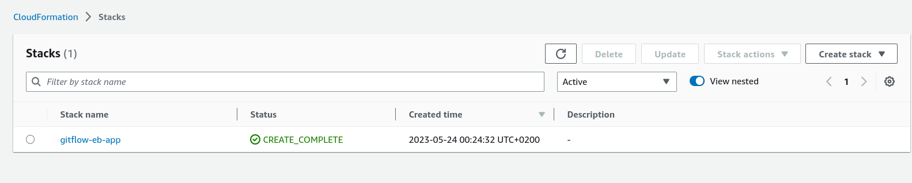
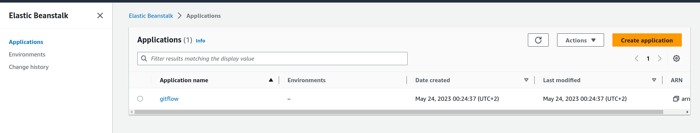

### Part: [ELastic Beanstalk Application](https://catalog.us-east-1.prod.workshops.aws/workshops/484a7839-1887-43e8-a541-a8c014cd5b18/en-US/cfn/master/beanstalk-application)

* Copy of the sample app's code
* Create code commit repo to host the code
* Pipeline takse code from the source and then performs actions on it

### STAGE1:

Before step 1, important open in own AWS account , in CodeCommit repo with name: gitflow-workshop

- Before using COdeCommit, user need to connect Code COmmit and local computer over HTTPS, SSH or HTTPS(GRC)

[HTTPS Setup for user Code Commit](https://docs.aws.amazon.com/codecommit/latest/userguide/setting-up-gc.html?icmpid=docs_acc_console_connect_np)

Add persmissions for user: Select **AWSCodeCommitPowerUser**

Generated password and username by AWS during process of creating HTTPS access for IAM user to CodeCOmmit. Link on [STEP3] (https://docs.aws.amazon.com/codecommit/latest/userguide/setting-up-gc.html?icmpid=docs_acc_console_connect_np)

CLI will notice you with message (but that's ok, because still we don't have anything in repo)

        warning: You appear to have cloned an empty repository.

**IMPORTANT: SAVE PASSWORD AND GENERATED USER- YOU WILL NEED IT LATER TO LOGIN USING CLI ON CODECOMMIT REPO INSIDE OF AWS.**

### Stage 2: Download the sample code and commit your code to the repository

1. Download the Sample App archive by running the following command from IDE terminal.

        ASSETURL="https://static.us-east-1.prod.workshops.aws/public/442d5fda-58ca-41f0-9fbe-558b6ff4c71a/assets/workshop-assets.zip"; wget -O gitflow.zip "$ASSETURL"

This command will download zip file on our local repo. 

CLI: 

----------

2. Unarchive and copy all the contents of the unarchived folder to your local repo folder.

        unzip gitflow.zip -d gitflow-workshop/

3. Change the directory to your local repo folder. Run git add to stage the change
   Name of my repo: gitflow-workshop-sun

        cd gitflow-workshop-sun

        git add -A

**Command git add -A:**

The easiest way to add all files to your Git repository is to use the “git add” command followed by the “-A” option for “all”. In this case, the new (or untracked), deleted and modified files will be added to your Git staging area.

4. Run git commit to commit the change and push it to master

        git commit -m "Initial Commit"

        git push origin master

Adding all files from local folder 'gitflow-workshop-sun' for commiting on COdeCommit repo on AWS

Pushing files on CodeCOmmit using generated password and user for CodeCommit.

## Create Elastic Beanstalk Application

To use Elastic Beanstalk we will first create an application, which represents your web application in AWS. In Elastic Beanstalk an application serves as a container for the environments that run your web app, and versions of your web app's source code, saved configurations, logs, and other artifacts that you create while using Elastic Beanstalk.

Run the following AWS CloudFormation template to create

Elastic Beanstalk application - think of it as a folder that will hold the components of your Elastic Beanstalk

S3 bucket for artifacts - place to put your application code before deployment

        aws cloudformation create-stack --template-body file://appcreate.yaml --stack-name gitflow-eb-app

OUTPUT of command.

    aws cloudformation create-stack --template-body file://appcreate.yaml --stack-name gitflow-eb-app
    {
    "StackId": "arn:aws:cloudformation:us-east-1:9352387528357232:stack/gitflow-eb-app/2465346260-f9b8-11ed-b6bf-0453461"
    }

Elastic Beanstalk App created 

