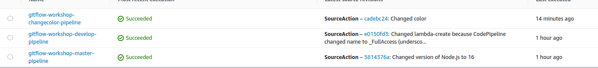

## Feature Branches

Each new feature should reside in its own branch, which can be pushed to the central repository for backup/collaboration. But, instead of branching off of master, feature branches use develop as their parent branch. When a feature is complete, it gets merged back into develop. Features should never interact directly with master.

The idea is to create a pipeline per branch. Each pipeline has a lifecycle that is tied to the branch. When a new, short-lived branch is created, we create the pipeline and required resources. After the short-lived branch is merged into develop, we clean up the pipeline and resources to avoid recurring costs.

Change-Color-EB

Pipeline 

Changed color EB App - green

Changed color EB App - purple

## Feature finish

Step 2: Delete the feature branch change-color and push it to remote at the same time.

     git push --set-upstream origin develop

## Cleanup

Delete Develop & Master Environments

    aws cloudformation delete-stack --stack-name gitflow-eb-master
    aws cloudformation delete-stack --stack-name gitflow-workshop-develop

Delete Feature Environment

    aws cloudformation delete-stack --stack-name gitflow-workshop-feature-change-color

Delete Lambda Functions

    aws cloudformation delete-stack --stack-name gitflow-workshop-lambda

Delete Elastic Beanstalk Application

1. Delete bucket files, then command 

        aws cloudformation delete-stack --stack-name gitflow-eb-app

Delete code commit repository

    aws codecommit delete-repository --repository-name gitflow-workshop