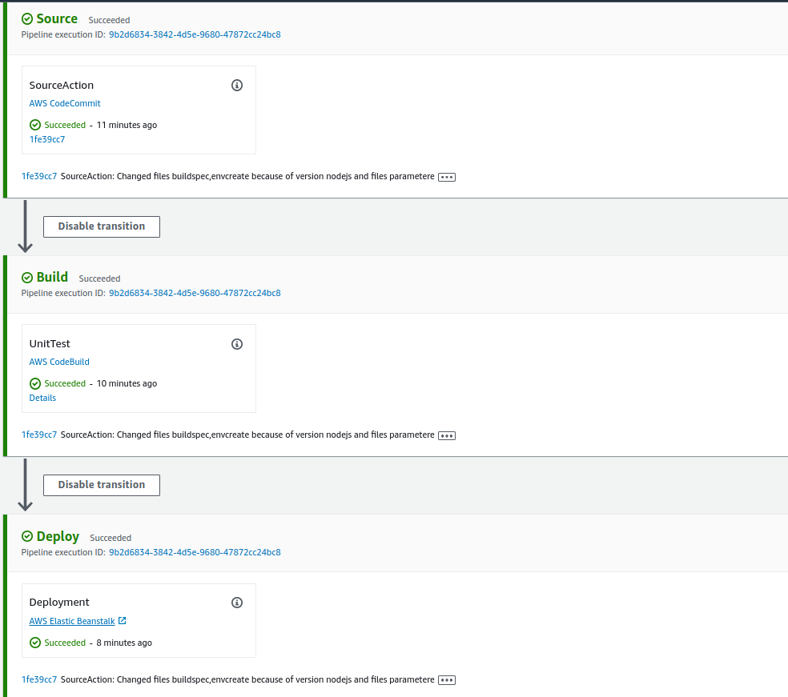

1. 
You can deploy multiple environments when you need to run multiple versions of an application. For example, you might have development, integration, and production environments

Use the following AWS CloudFormation templates to set up the elastic beanstalk application and codepipeline to do auto store the artifacts.

Command

    aws cloudformation create-stack --template-body file://envcreate.yaml --parameters file://parameters.json --capabilities CAPABILITY_IAM --stack-name gitflow-eb-master

But there was some problems creating this ElasticBean M.Env. and its resolved: 

Resolved problems in part 'Master Environment' on link: [problems-and-fixing](problems-and-reslove.md)

**IMPORTANT: CHANGED NODEJS VERSION AND PARAMETERS FILE PUSH ON CODE COMMIT.**

## AWS CodePipeline

AWS CodePipeline is a continuous delivery service you can use to: 

- Model
- Visualize
- Automate the steps required to release your software

Above cloudformation template will also create and configure a simple AWS CodePipeline with three actions: source, build and deploy. 

