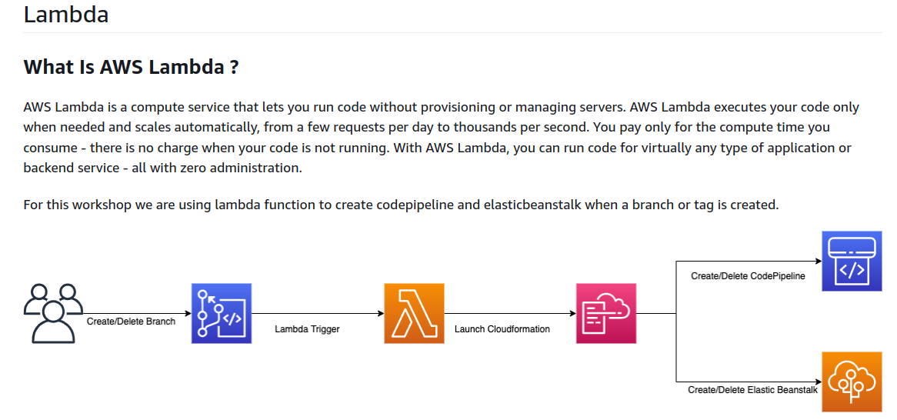
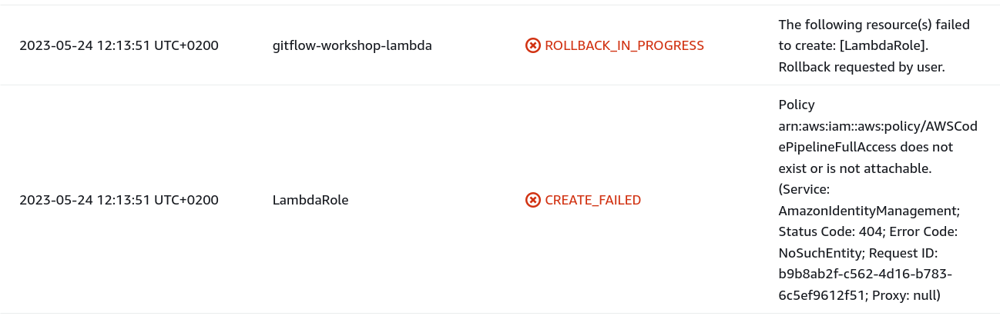
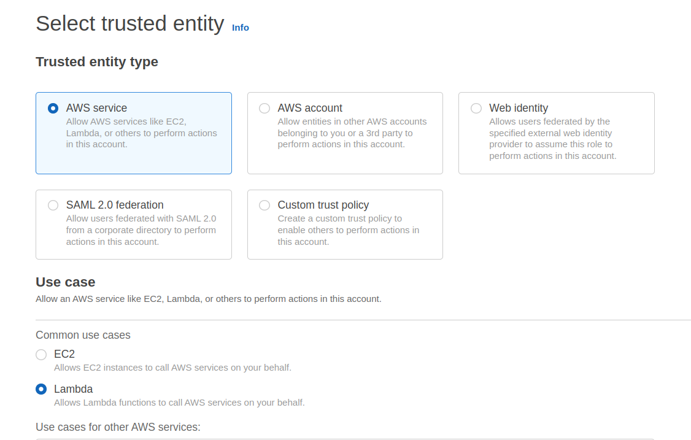
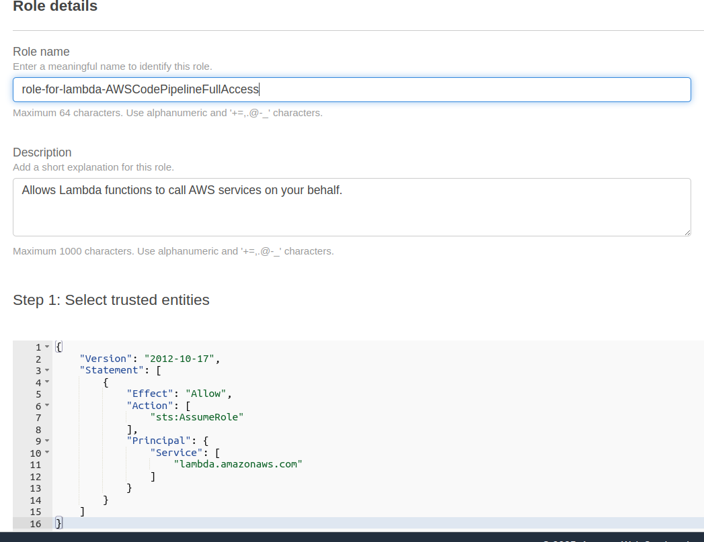
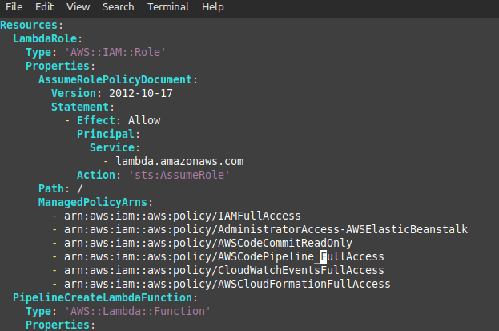
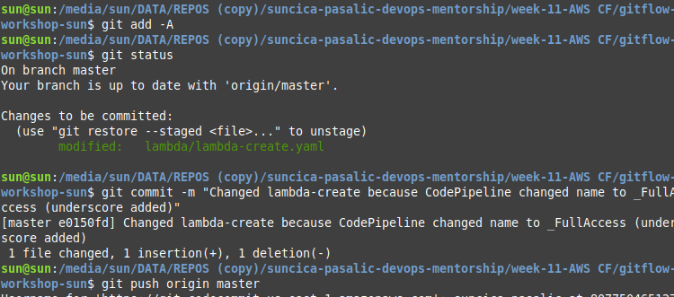
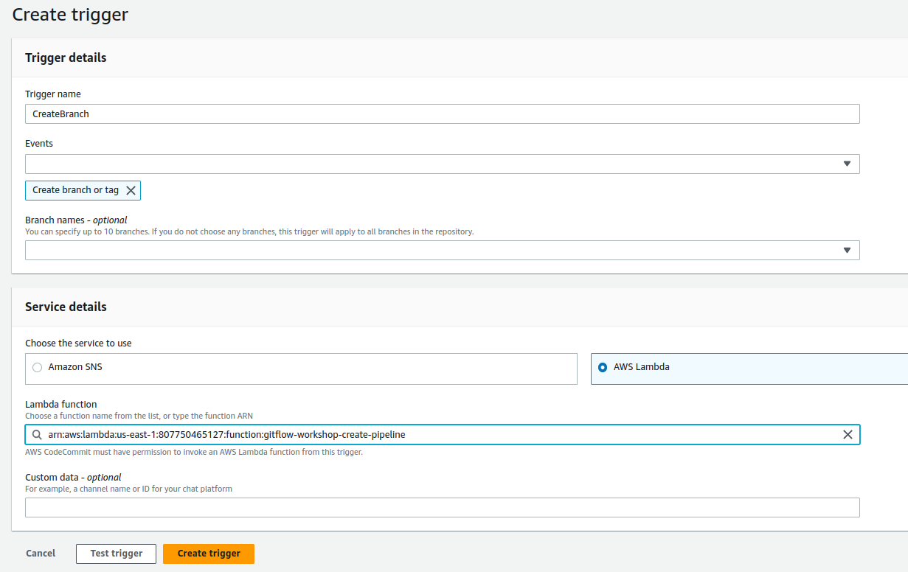
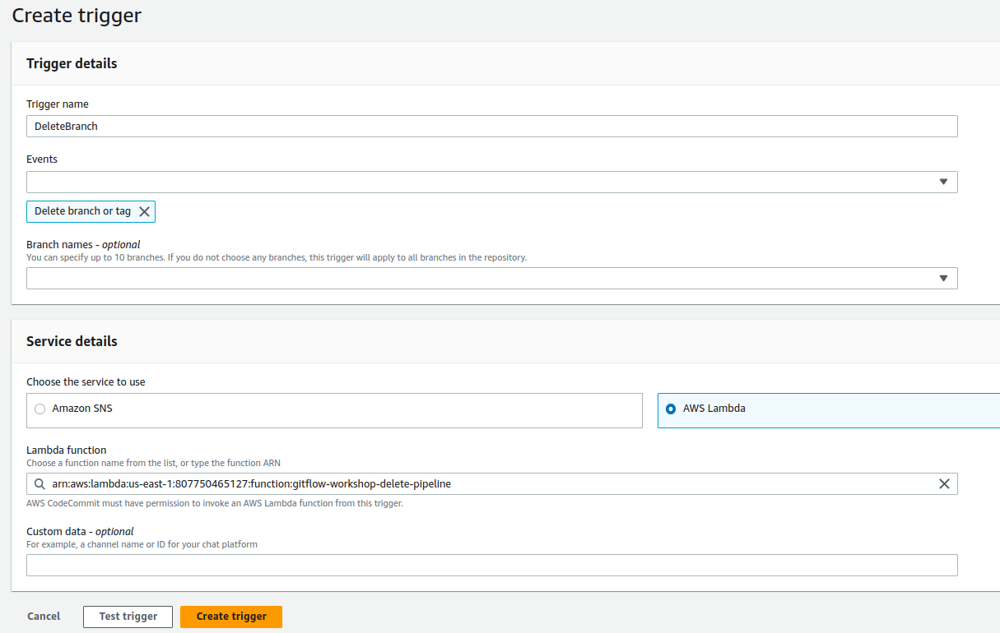

## ERROR 5 - Create Lambda 

After command: 

    aws cloudformation create-stack --template-body file://lambda/lambda-create.yaml --stack-name gitflow-workshop-lambda --capabilities CAPABILITY_IAM

User will get error for lambda role. 

## FIXED: 
1. User need to add role and permissions for user and for lambda 
   

2. After this, user need to change file lambda-create.yml (folder lambda) change the name of policy from **AWSCodePipelineFullAccess** to **AWSCodePipeline_FullAccess**

3. This changes commit on CodeCommit and push to origin master

4. Then in CLI run command 

        aws cloudformation create-stack --template-body file://lambda/lambda-create.yaml --stack-name gitflow-workshop-lambda --capabilities CAPABILITY_IAM

## Part 2: Create a Trigger in AWS CodeCommit for an Existing AWS Lambda Function

In this step you will create a trigger in CodeCommit which invokes a Lambda function when a branch or tag is created. (Workshop on [link](https://catalog.us-east-1.prod.workshops.aws/workshops/484a7839-1887-43e8-a541-a8c014cd5b18/en-US/cfn/lambda/lambda-trigger) )

CodeCommit->Repo (gitflow-workshop-sun) -> Settings -> Triggers

### Create trigger -create-pipeline

### Create trigger - delete-pipeline

