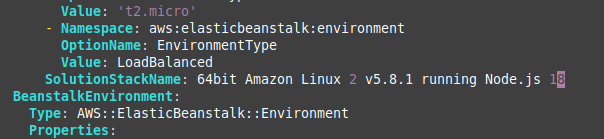
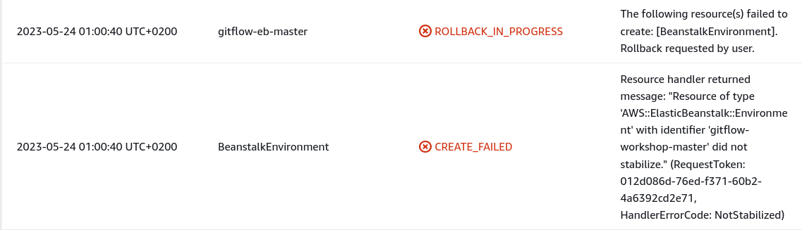
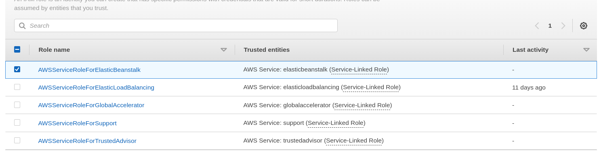
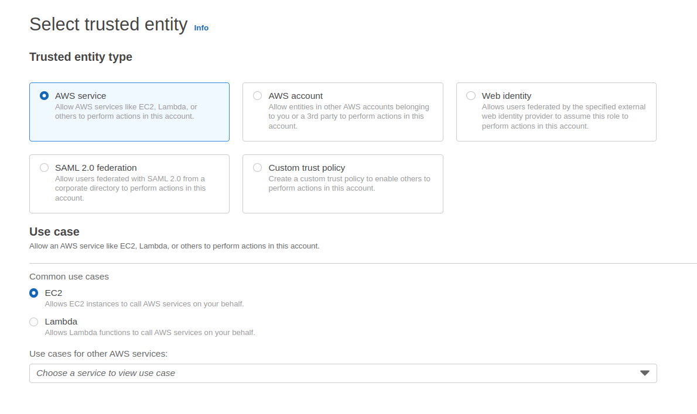
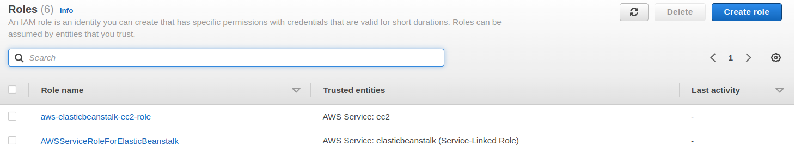
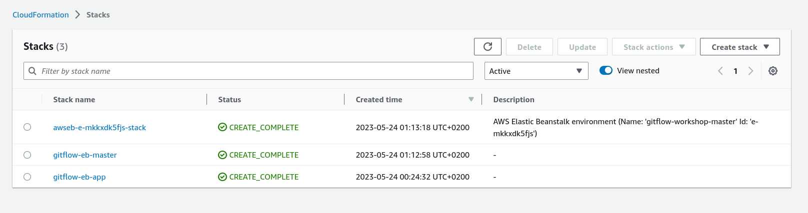
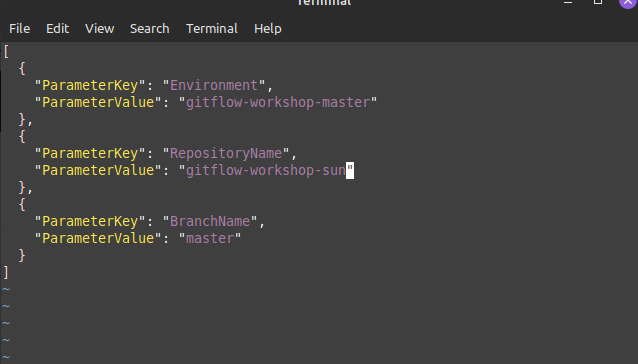
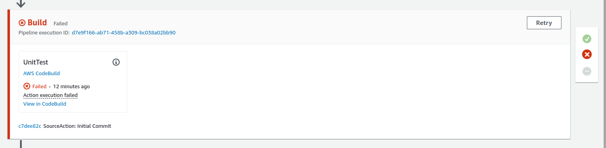
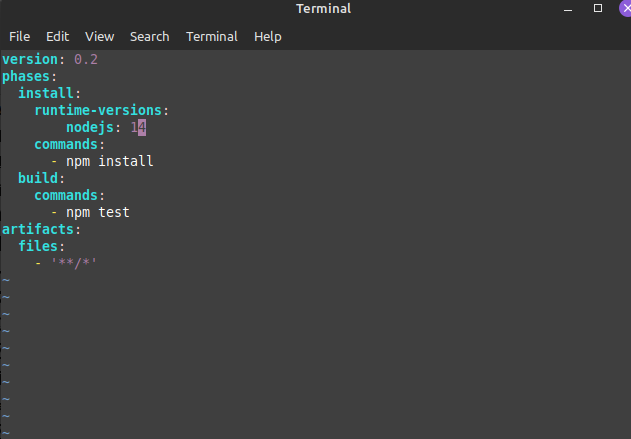
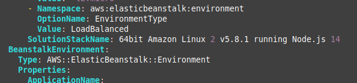

### One of the problems in workshop CF creatin of master-environment

### Creating an AWS Elastic Beanstalk Master EnvironmentHeader anchor link
**Error 1**

User need to change: SolutionStackName in the yaml file under the name "envcreate.yaml", version of node js 18, and 64 bit Linux v2 5.8.1 instead of version by default from download file. 

**Erorr 2**

User need to add role 'aws-elasticbeanstalk-ec2-role', so EC2 can call EB services. 

Fixed

EC2

Add just role, next on permissions and complete..

Output-Create-complete

----------------

### AWS CodePipeline

**PHASE: Source** 

Error with pipeline, because user didn't use default name of repo in workshop.

Fixed-> change the name of repository name in the file 'parameters.json'

## Important: DON'T DELETE ONLY PIPELINE MANUALLY! 

**CONSOLE->CLOUDFORMATION->STACKS->'aws-eb---'  and 'gitflow-eb-master' -> DELETE** 

Wait CloudFormation to delete all resources and templates (you can check that there is no more codepipeline under the name 'gitflow-pipeline' in Pipeline(left side)), go to CLI and run again command: 

    aws cloudformation create-stack --template-body file://envcreate.yaml --parameters file://parameters.json --capabilities CAPABILITY_IAM --stack-name gitflow-eb-master

Because user need it to change repo name, but in file 'parameters.json' . From file parameters.json, template envcreate take the parameters for environment. 

Note: Change the name of repository name in file parameters-dev.json (maybe it will need it in the last phase of pipeline)

**PHASE: BUILD**

## IMPORTANT! PUSH ALL CHANGED FILES ON CODE COMMIT REPO gitworkflow-workshop-sun!

Open file: buildspec.yml and change the version of nodejs: 
Open file: envcreate.yml and change version of AMI 

- from 16 to 18 (not worked)
- from 18 to 14.  (WORKS)

64bit AMI LINUX 2 v5.8.1

AGAIN: Delete or Update  CloudFormation stacks:

**Don't forget locally made changes on templates.** 

Stack name
- awseb-e-8cmgu35sbb-stack
- gitflow-eb-master

Repeat steps from: [Elastic Beanstalk App](https://catalog.us-east-1.prod.workshops.aws/workshops/484a7839-1887-43e8-a541-a8c014cd5b18/en-US/cfn/master/beanstalk-application)  to push on Code Commit changed files in files. 

FIXED

