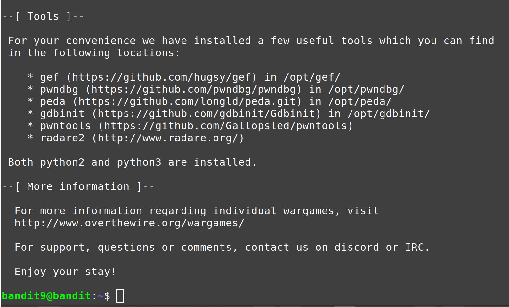

# Level 0

Login na server preko porta (-p) 2220

`$ ssh -p 2220 bandit0@bandit.labs.overthewire.org` 

# Level 0-1
**$ pwd** prikazuje trenutni direktorij u kojem se nalazimo 

**$ ls** - lista sve fajlove i direktorije

# Level 1-2

`pwd` - prikazuje trenutni direktorij u kojem se nalazimo

`ls` - lista sve fajlove i direktorije

`cat naziv_fajla ` ispisuje sadržaj fajla

`$find ime_fajla` - pronalazi file u direktoriju

`$du --time naziv_fajla` - prikazuje zadnju promjenu na fajlu

# Level 2-3
`ls -l` - lista fajlove unutra direktorija unutar /home/bandit
`cat "spaces in this filename" - fajl (spaces in this filename) u sebi sadrži razmak, da bi se ispisao sadržaj ovakvog fajla u Linuxu potrebno je da se stavi pod navodnike naziv fajla. Drugi način za ispis sadržaj je koristeći znak kose crtice (\), bez duplih navodnika. 

Načini ispisivanja sadržaja fajla koji ima razmake u nazivu:

a)`cat "spaces in this filename"` - ispisuje sadržaj fajla 

b)`cat spaces\ in\ this\ filename`

# Level 3-4
`$ls -la` - sadržaj direktorija, a sa -a ispisuju se i skrivene datoteke

`$ls -lh` - sadržaj foldera ali prikazuje i veličinu datoteke u KB,MB ili GB

`$cd inhere`- promjena direktorija (s /home u folder /inhere)

`~/inhere$ cat .hidden` - prikazuje sadržaj .hidden fajla  

# Level 4-5
`$cd inhere`- pristupamo /inhere direktoriju

`~/inhere$ file -- * ` - prikazuje fajlove od 00 do 09 
koji postoje u folderu /inhere,a zatim vidimo koji fajl sadrzi ASCII tekst u kojem se nalazi password za sljedeci nivo

`cat -- \-file07 ` - prikazujemo sadrzaj fajla -file07

# Level 5-6

`ssh -p 2220 bandit5@bandit.labs.overthewire.org ` - login na level5

`$cd inhere` - prelazak iz home u inhere direktorij

`$find -type f -size 1033c -exec ls {} \; ` - pronalazi fajla, koji ima velicinu 1033 bajta 

`$cat ./maybehere07/.file2 `- ispisuje sadržaj fajla .file2

# Level 6-7
`$find / -type f -user bandit7`- Pronalazi fajl čiji je vlasnik korisnik bandit7

`cat /var/lib/dpkg/info/bandit7.password`- ispisuje vrijednost fajla bandit7.password

# Level 7-8
`$grep "millionth" data.txt` - pronalazi riječ "millionth" u fajlu data.txt

`grep` - filtrira i pronalazi određenu riječ/tekst

# Level 8-9

`sort data.txt | uniq -u`- Funkcija sort sortira po redu (-o), -n (numerički-po redu)

`-u`- filtrira unikatne linije (linije koje se pojavljuju samo jednom)

`uniq`- komanda koja filtrira input, prikazuje jedinstvene linije u sortiranoj datoteci

   
# Level 9-10

`grep` - komanda grep služi za pretraživanje određene npr. riječi u fajlu. Ukoliko napišemo `$grep "sun" Imenik.txt`, komanda će pretraživati riječ "sun" u fajlu Imenik.txt

`awk` - pretražuje se neka rijec iz teksta ili se izvršava neka akcija da se pronađe tekst. 
` cat data.txt ` - ispisuje sadržaj fajla data.txt

`grep "==*" data.txt -o` 

`cat data.txt | strings -e s | grep ==`

