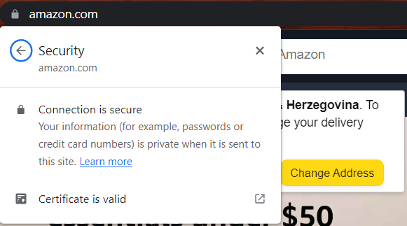

HTTP je ono sto se koristi kad god pogledamo web stranicu, koju su razvili Tim Berners-Lee i njegov tim izmedju 1989-1991. 

**HTTP (Hypertext transfer Protocol) - protokol za prenos informacija na webu.**

HTTP je skup pravila koji se koristi za komunikaciju sa WEB serverima za prenos podataka web stranica, a to moze biti HTML, slike, video itd. 

**HTTPS (Hypertext Transfer Protocol Secure)** je sigurna verzija HTTP protokola. Podaci koji se prenose preko HTTPS protokola su enkriptovani, sto znaci da podaci koji se salji i primaju preko ovog protokola su sigurni od drugih ljudi (npr. hakera), ali i da 100% "razgovaramo" sa određenom stranicom. Npr. ako trebamo platiti online narudzbu preko paypal-a, amazona, mozemo biti sigurni da su nasi podaci sigurni i da je to odgovarajuca stranica. 

