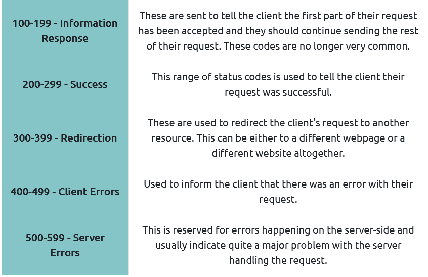
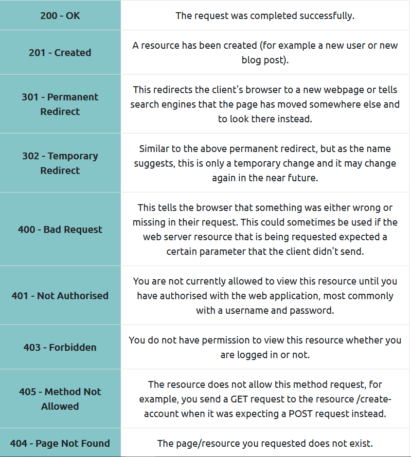
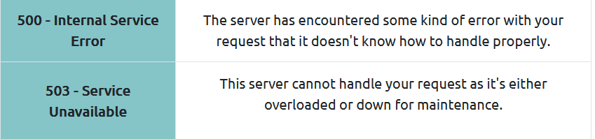

**HTTP REQUEST - HTTP ZAHTJEV**
**HTTP RESPONSE - HTTP ODGOVOR**

Kada pristupimo web stranici, nas browser (chrome) ce trebati da napravi zahtjeve (requests) prema web serveru za slikom, HTML-om, videom i uraditi download odgovora. Prije nego sto se to desi, moramo "reci" browseru SPECIFICNO **KAKO I GDJE** da pristupi ovim resursima (slika, video..), u ovom nam pomaze **URL.**

**URL (Unifrom Resource Locator)** je uglavnom instrukcija, kako pristupiti resursu na internetu. Ko je user koji pristupa, koja je domena, koji je port, koji je path (putanja) do odredjenog resursa ili lokacije, koja je to stranica (page8) tj fragment. 

Izvor:geeks for geeks

**Scheme:** Pokazuje koji protokol je koristen za pristup resursima. Odredjene stranice zahtjevaju koristenje HTTP, danas vecina HTTPS protkol, ali neke i FTP protokol (File Transfer Protocol).

**USER:** - Odredjene stranice zahtjevaju korisnicke podatke za login (username i password).

**HOST** je domena ili IP adresa servera kojem zelimo da pristupimo. 

**PORT** prikazuje broj porta na koji cemo se konektovati, obicno je to broj porta 80 za HTTP, 443 za HTTPS protokol, ali to moze biti bilo koji broj protokola izmedju 1-65535. 

**PATH (PUTANJA)** predstavlja ime fajla ili lokaciju do resursa kojima zelimo pristupiti. 

**QUERY STRING** predstavlja dodatne informacije koje mogu biti poslate zahtjevanoj putanji (requested path). Npr.
/blog?id=1 ce "reci" blog putanji da zelimo receive (primiti) blog artikal (sadrzaj) sa id koji je jednak broju 1. 

OBJASNJENJE METODA KOJE SE KORISTE U HTTP PROTOKOLU:
[HTTP METODE - GET, PUT, POST, PUT, HEAD, DELETE](https://www.w3schools.com/tags/ref_httpmethods.asp)

**GET REQUEST** - se koristi da bi se dobili odredjeni podaci sa specificnog resursa (npr web servera).

**POST REQUEST** - koristi se da POSALJE podatke na server da kreira ili uradi update resursa. Npr. saljemo podatke za login ili radimo update mail-a (update records).

**PUT REQUEST**

PUT is used to send data to a server to create/update a resource.

The difference between POST and PUT is that PUT requests are idempotent. That is, calling the same PUT request multiple times will always produce the same result. In contrast, calling a POST request repeatedly have side effects of creating the same resource multiple times.

**DELETE REQUEST** koristi se za brisanje podataka/informacija sa servera. 

## HTTP STATUS KODOVI 

Postoji 5 razlicitih opsega HTTP status kodova: 

NAJCESCI HTTP STATUS KODOVI: 

[Lista HTML Error POruka](https://www.w3schools.com/tags/ref_httpmessages.asp)

## HEADERS 

Headers su dodatni detalji koje mozemo da posaljemo web serveru kada pravimo zahtjev (request). Headeri nisu striktno potrebni kada pravimo HTTP zahtjev. 

Vise o REQUEST HEADERS [na linku](https://oxylabs.io/blog/http-headers-explained)

