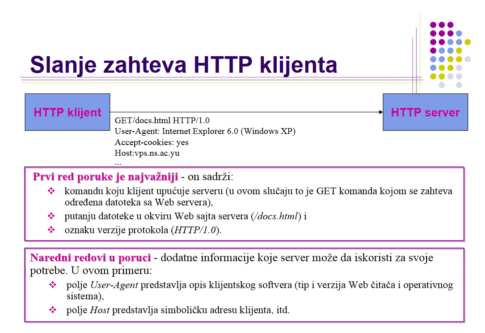
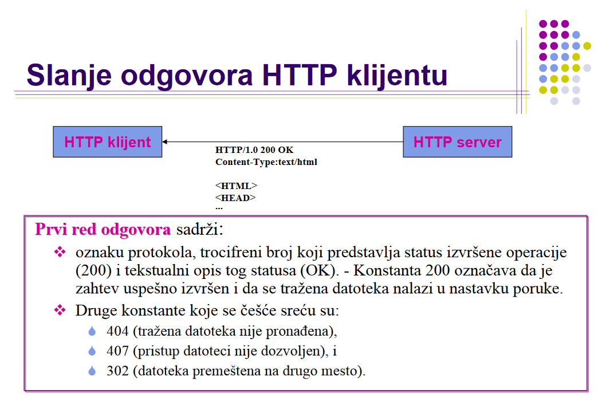
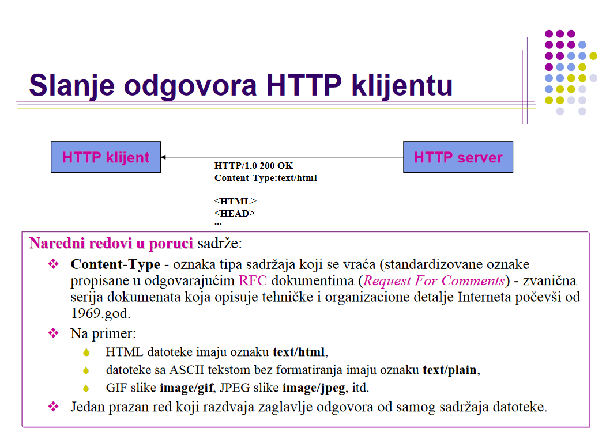

## SLANJE HTTP ZAHTJEVA OD KLIJENTA PREMA SERVERU 

## ODGOVOR HTTP OD SERVERA PREMA KLIJENTU

- Zadatak servera je da nakon sto primi zahtjev HTTP klijenta odgovori na njega. 
- U ovom slucaju odgovor servera treba da sadrzi trazenu datoteku (docs.html), pri cemu je odgovora takodjer defnisan HTTP protokolom. 

- Drugi dio odgovora klijentu

- HTTP protokol ne omogućava pracenje sesije korisnika, pa je definisano pomocno rijesenje- mehanizam slanja cookies ili kolacica izmedju klijenta i servera. Cookie je tipicno 20-30 nerazumljivih znakova koji je namijenjen za jedinstveno identifikovanje korisnika na serveru. 
  
- Prilikom slanja prvog zahtjeva server ce ustanoviti da mu klijent nije poslao cookie kao jednu od stavki u zaglavlju zahtjeva.
  
- U odgovor na taj zahtjev server ce dodati cookie. 
  
- Ukoliko je web browser podesen tako da radi sa cookie-ima (a danas se pojavi poruka koje cookie zelite da dozvolite), on ce u svim sljedecim zahtjevima koje bude slao tom serveru **ukljuciti i cookie**, tako da server moci da prepozna klijenta koga je vec ranije **opsluzivao.**

Izvor: https://www.vps.ns.ac.rs