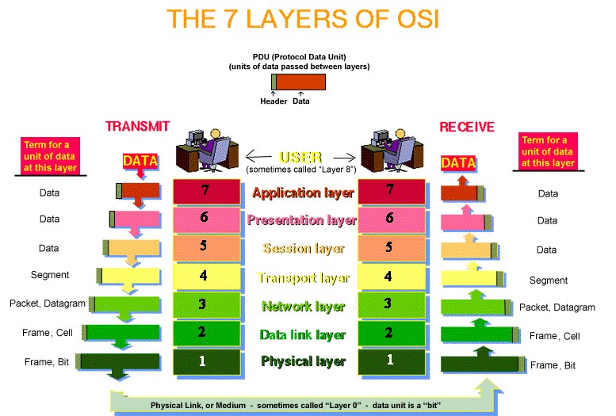
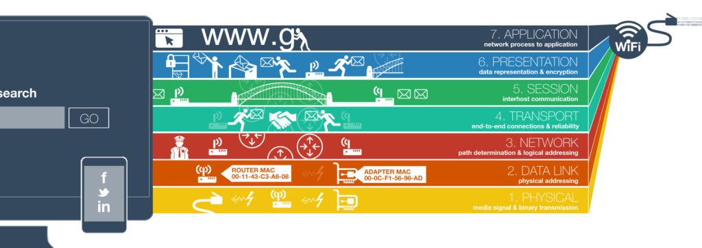
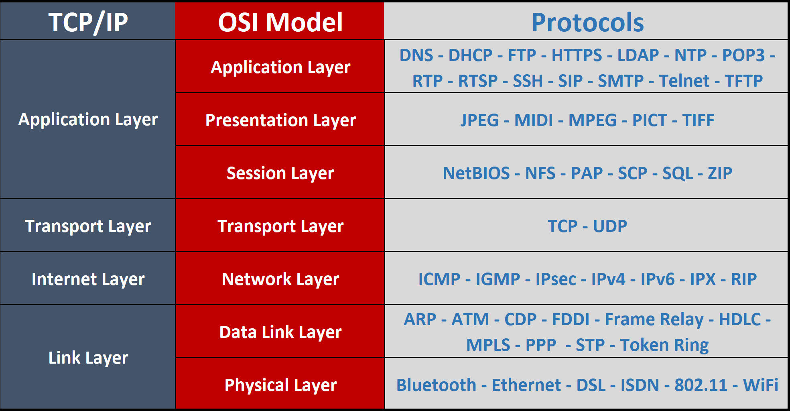
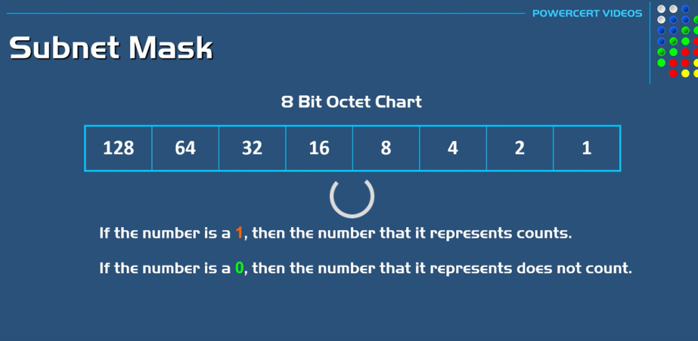
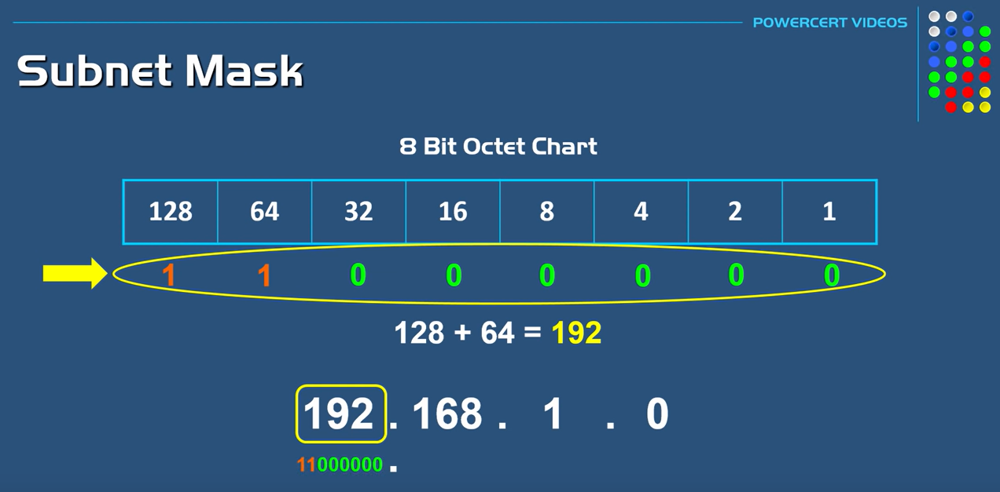
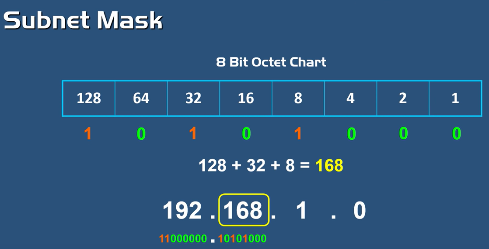
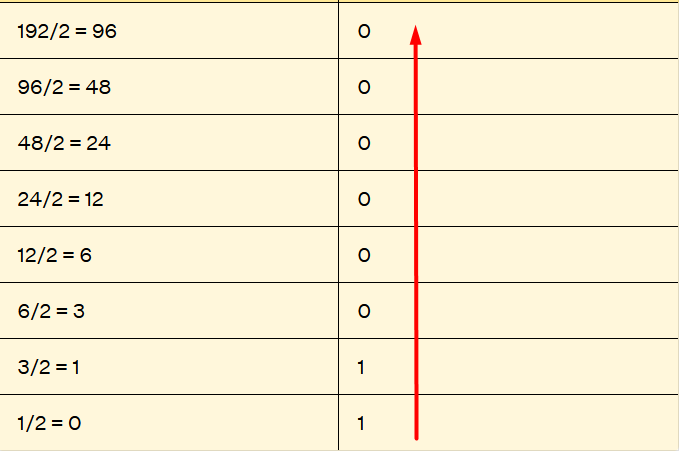
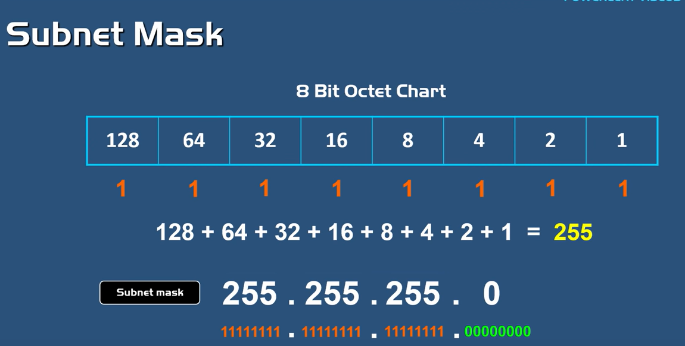
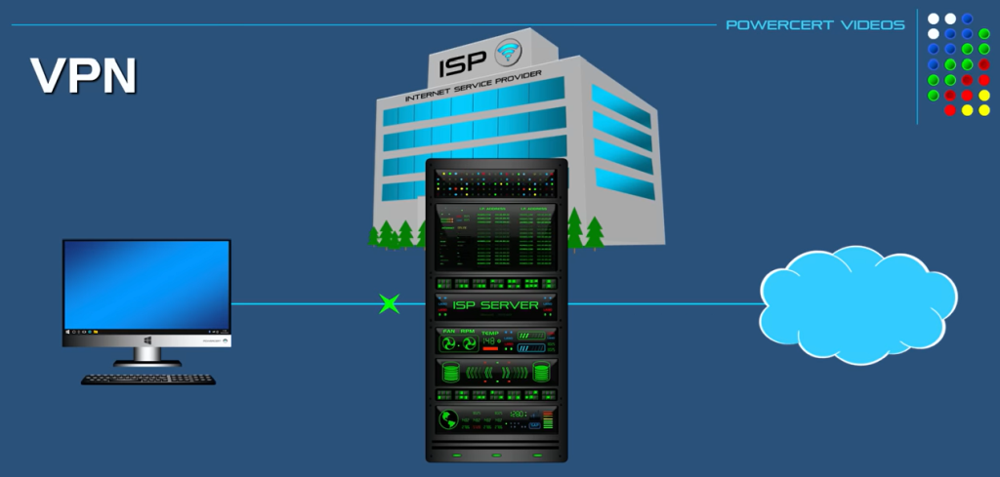

# OSI Model 

**OSI model i paketi**

OSI model je standard koji je razvijen kako bi olaksao razvoj protokola ali i komunikacije. Svaki OSI sloj moze da se razvija neovisno jedan o drugome. Standardizovan je nacin komunikacije između softverskih i hardverskih komponenti koji su ukljuceni u mreznu komunikaciju te kako trebaju podijeliti posao, ali i komunicirati medjusobno.

VIdeo o OSI modelu za svaki nivo [realni video primjeri](https://www.youtube.com/watch?v=0y6FtKsg6J4)

Svaki OSI layer (nivo, sloj) vodi računa o načinima slanja podataka preko svih nivoa. OSI (kao i TCP model) koristi pakete, tj. a u zavisnosti od nivoa, oni se različito nazivaju. Ako se radi o mrežnom nivou OSI modela, onda se podaci šalju u paketima, ako se radi npr. o Data Link nivou (podatkovni nivo) onda se paketi pakiraju u **SEGMENTE**.

Kada podaci "putuju" od IZVORA (npr. korisnik koristi laptop da šalje email) oni se "pakiraju" kako bi bili pogodniji za prenos. Ovaj proces se naziva ENKAPSULACIJA. 
Na svakom OSI nivou, paket dobiva neki dodatak, koji dodatno štiti podatke tj. pakete. 

\
&nbsp;

Enkapsulacija se odvija na izvoru(PC) koji šalje podatke. 

**ENKAPSULACIJA - PROCES OD NIVOA 7 DO NIVOA 1**

**DEKAPSULACIJA - PROCES OD NIVOA 1 DO NIVOA 7**

**Animacija OSI modela na** [videu](https://www.youtube.com/watch?v=VGGmBhARuiY)

 

**Poređenje OSI i TCP/IP model**

Razlika između [TCP i OSI modela](https://community.fs.com/blog/tcpip-vs-osi-whats-the-difference-between-the-two-models.html)

# Sta su to protokoli?

Animirani video o protokolima [link na video](https://www.youtube.com/watch?v=g2fT-g9PX9o)

**Protokoli** - nisu fizicka konekcija, nego logicka (pravila komunikacije) koja je koristena izmedju razlicitih uredjaja (hardvera) i razlicitog softvera (servisa, programa) koji su umrezeni kako bi razmijenili informacije. Ova pravila su bitna kako bi npr. email koji korisnik posalje drugom korisniku mogao da stigne pravoj osobi. Protokol za prenos elektronske poste na internetu je SMTP, POP, IMAP. 

POP, SMTP, IMAP su standardni protokoli koji se koriste u slanju i primanju e-mail poruka.

**Ljudski protokol** - dogovoreni protokol na koji nacin ce se komunicirati sa klijentima na sastanaku, pravila kulturnog ponasanja, kada jedan govori drugi slusa sta sagovornik govori itd. 

**OSI i protokoli**

Protokoli za svaki OSI sloj

\
&nbsp;

# IPv4 adresiranje

Sjajan [video o](https://www.youtube.com/watch?v=s_Ntt6eTn94) subnet mask i IP adresi.

Predstavljanje 8 bita (oktet)

Pretvaranje iz decimalnog u binarni broj (0 i 1) 

METODA 1 
    Ako je broj 1, onda broj koji ga predstavlja se računa. 
    Ako je broj 0, onda broj koji ga predstavlja se ne računa. 

Primjer pretvaranje adrese 192.168.1.0 u binarni broj. 
a) Pretvaranje broja 192 u binarni

b)Pretvaranje broja 168 u binarni

METODA 2: 
    Ako je IP adresa 192.168.3.2, onda se svaki broj podijeli sa dva i u reverznom obliku se pise binarni oblik broja 192.
    Binarni oblik broja 192 je: 110 000 00 (8 bita) 

RAČUNANJE SUBNET MASKE 

# Razlika izmedu privatne i javne (public) IP adrese

PRIVATNA IP ADRESA koristi se SAMO za internu upotrebu, koja se nalazi iza NAT uredjaja. Najcesce se koriste u privatnim LAN mrezama (kucna ili poslovna mreza). NAT (Network Address Translation) nam je potreban ukoliko imamo potrebu da neka od privatnih IP adresa bude javna

# Sta je IPv6, zasto nam je potrebna IPv6 adresa i koje su glavne razlike izmedju IPv4 i IPv6

# Sta je klijent - server arhitektura

# Ko je klijent i ko je server

# What is the TCP protocol

TCP - Transmission Control Protocol - standardni protokol koji definiše kako ce "razgovarati" i uspostaviti mrežnu komunikaciju pomocu kojeg ce aplikacije razmijenjivati podatke. 

Network Chuck video o TCP/IP - real life examples - [link](https://www.youtube.com/watch?v=3kfO61Mensg)

CCNA 200 - 301 (mrezni uredjaji, TCP/IP model, TCP vs UDP, brojevi portova, IP adresa, MAC adresa, ARP, DHCP korak po korak)

[video](https://www.youtube.com/playlist?list=PLF1hDMPPRqGxpYdo0ctaa7MxfOi9vjs1u)

# Šta je HTTP protokol i zasto ga koristimo? 

HTTP - Hyper Transfer Protocol

Video [kako HTTP protokol](https://www.youtube.com/watch?v=ALq0xKp3P9E) radi.

VIdeo kako HTTPS radi [link na video](https://www.youtube.com/watch?v=w0QbnxKRD0w)

# Koja je glavna razlika izmedju TCP i UDP protokola

# Sta je FQDN 

# Sta je DNS, zasto nam je potreban i kako radi

DNS - Domain Name System
DNS je hijerarhijski distribuirani sistem u kojem se mogu nalaziti različite informacije, prije svega o IP adresama, kao i simboličkim nazivima adresa.

Uloga DNS-a je da omogući korisniku da ne pamti IP adrese, nego konkretne nazive web stranice npr. www.google.com jer se mnogo lakse pamte od brojeva (npr. 192.166.3.3)

[ANIMACIJA - Kako radi DNS](https://www.youtube.com/watch?v=2ZUxoi7YNgs)

[Video o DNS](https://www.youtube.com/watch?v=27r4Bzuj5NQ)

# Sta je VPN

VPN - Virtual Private Network 

VPN nam pomaže da uspostavimo sigurnu i pouzdanu mreznu konekciju preko nesigurne mreze kao sto je internet. Štiti korisnike, poslodavce, kompanije od malicioznih korisnika, stiti identitet korisnika. 

Animirani video o VPN [link.](https://www.youtube.com/watch?v=R-JUOpCgTZc)

