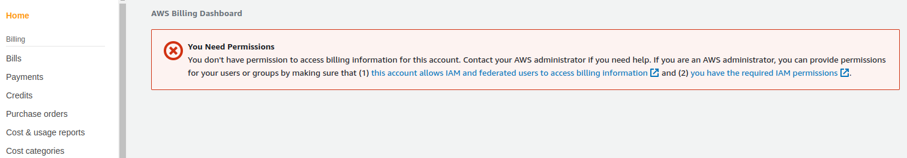
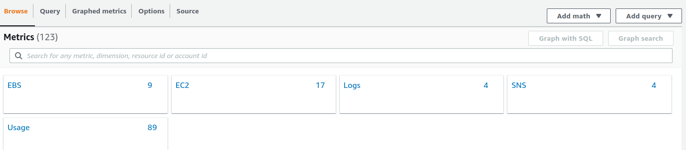
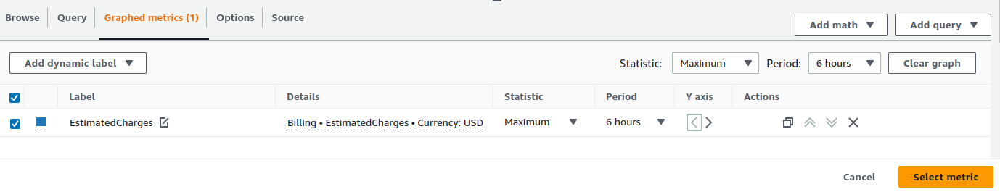
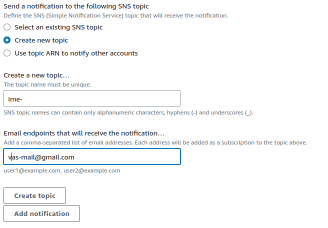
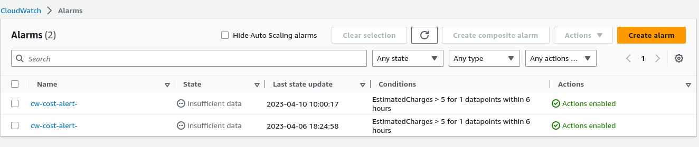

## IAM korisnik nije vlasnik AWS racuna

Permsije error:

CW metrics u konzoli:

Ukoliko korisnik nije vlasnik AWS accounta i nema permisije za Billing dio, problem moze da rijesi tako da kopira CW alert-estimated troskova od vlasnika AWS Accounta:
1. Selektuje se CW alarm od vlasnika AWS racuna

2. U desnom uglu Actions -> Copy 

3. U novom otvorenom prozoru, u desnom uglu klikne se na Edit i onda izabere Select metric

4. Klikne se next i kreira novi topic

 

5. SNS topic potvrdimo preko emaila na koji ce nam dolaziti obavijest o visini troskova 
6. Kreiramo ime za nas cw alert: cw-alert-ime-prezime
7. U dashboard vidimo novi alarm koji je upravo kreiran

