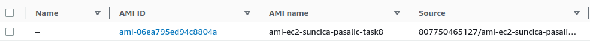
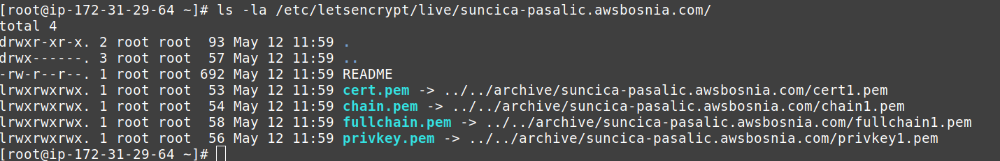
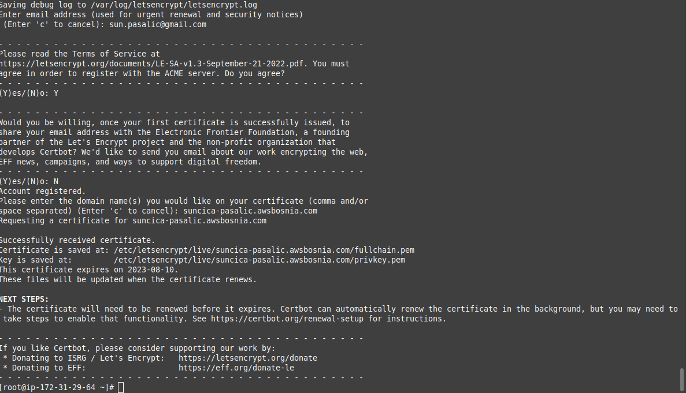
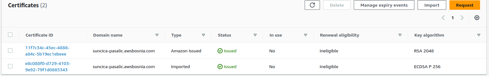
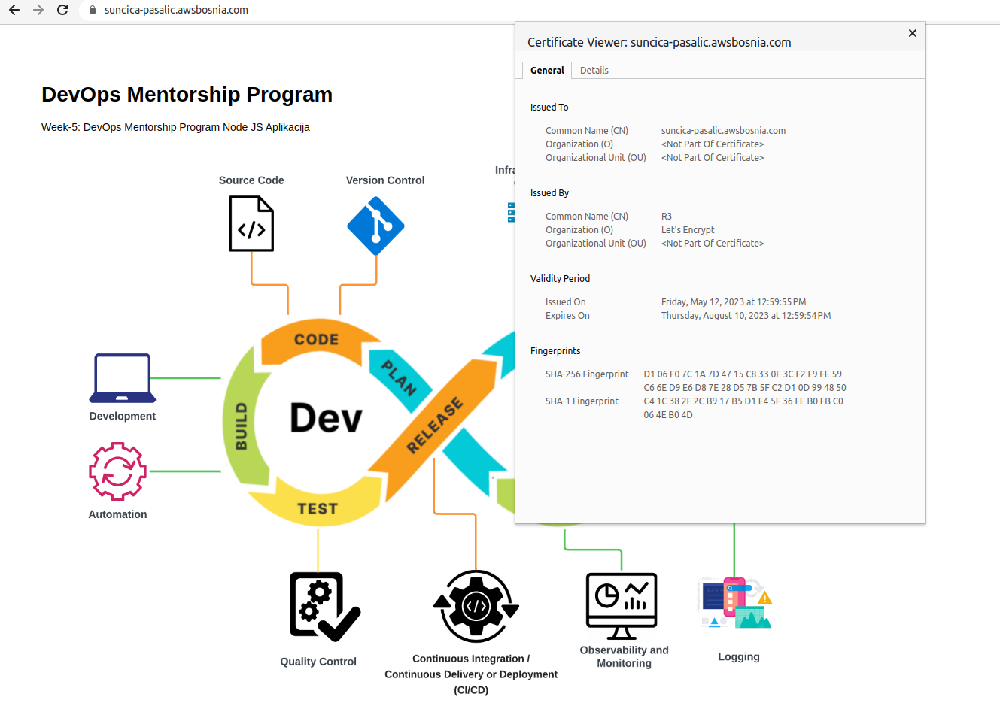
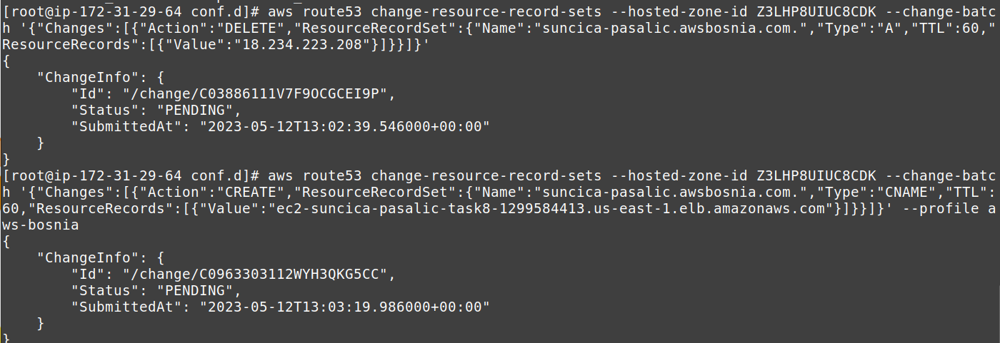
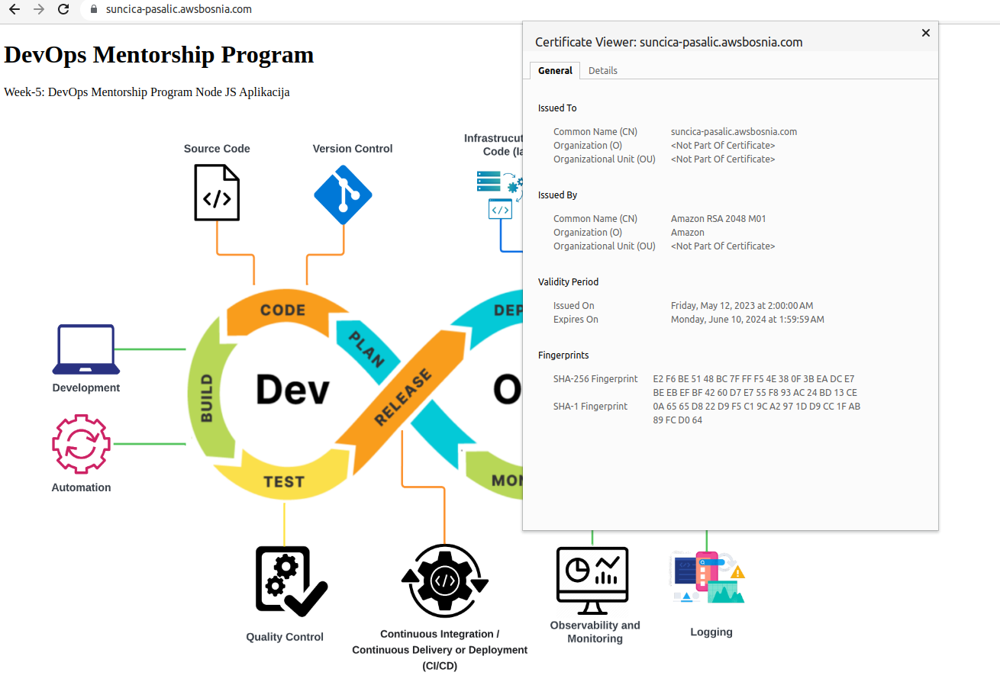
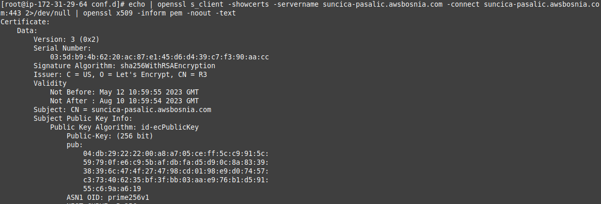
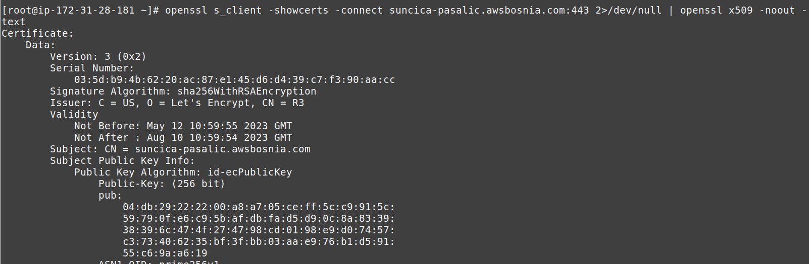
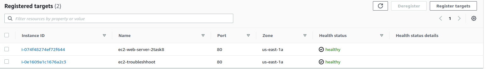

### TASK  8- Let's Encrypt SSL Certificate on EC2 Amazon Linux AMI3 (Nginx) step by step solution

### AMI Image: 

### Certificate CA (after certbot ok)

### CA Issued (ACM)

### Certifikat Let's Encrpyt 

### Delete - update - DNS

### CA issued

### Certifikat CA Amazon

### SSL Certificate and date

### SSL Certificate and date (Second EC2)

### Target groups - Healthy check - ALB

### Korak po korak: [Aleksandra Ljuboje](https://github.com/AleksandraLj/aleksandra-ljuboje-devops-mentorship/blob/main/week-9/Lets-encrypt-SSL.md)