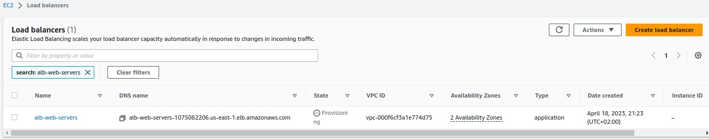
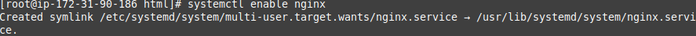
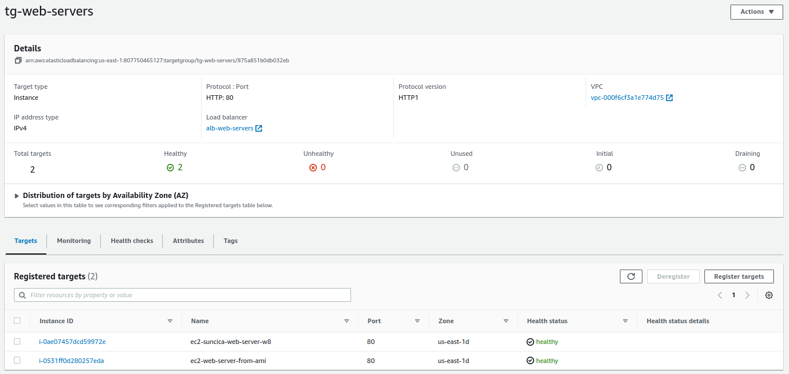

1. Kreiranje EC2 instance -> Amazon Linux AMI

EC2 instance imaju svoje Security grupe i pravila. 
   

1. Instaliranje i automatsko boot-anje EC2  instance i NGINX 

3. Kreiranje ALB i security grupe za ALB

ALB ima svoje sigurnosne grupe i pravila, na osnovu koji dopusta saobracaj do EC2 instanci ili ne dopusta. Na ovaj nacin je povecana sigurnost web-servera i zastita podataka na klijentovoj aplikaciji.

4. Target grupe

Target grupe su povezane sa ALB, unutar target grupe smjestamo EC2 instance, onda ALB zna prema kojim instancama da proslijeđuje saobracaj.

