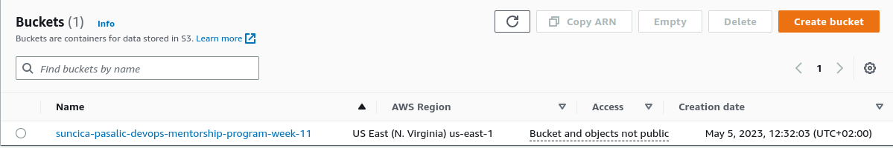
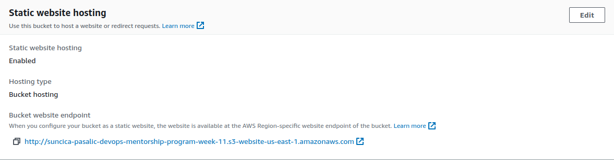
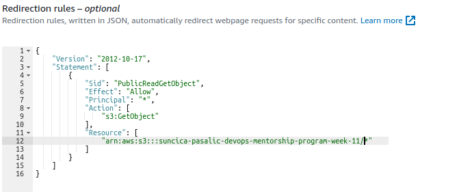
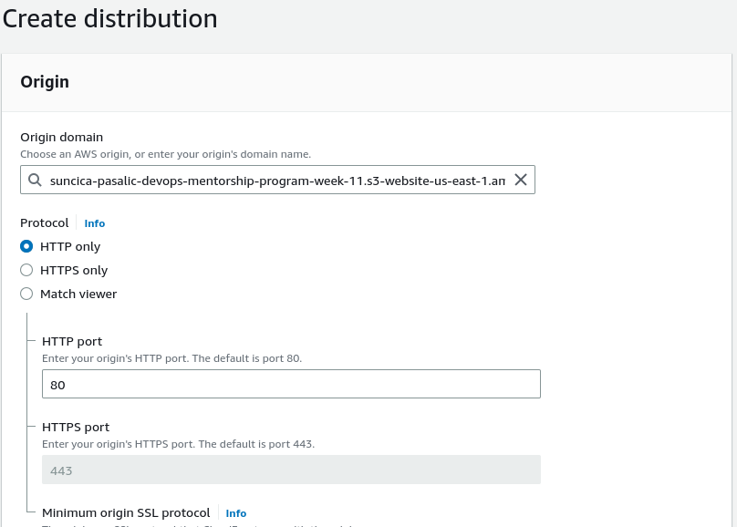
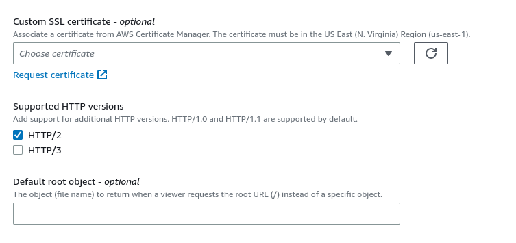
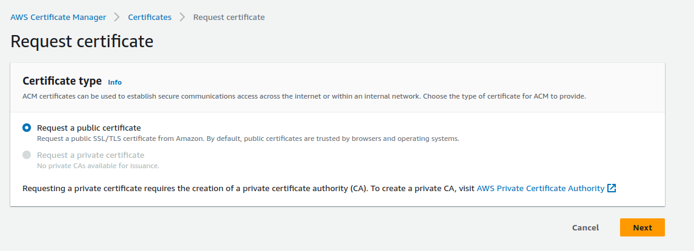
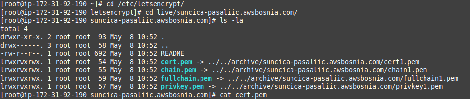
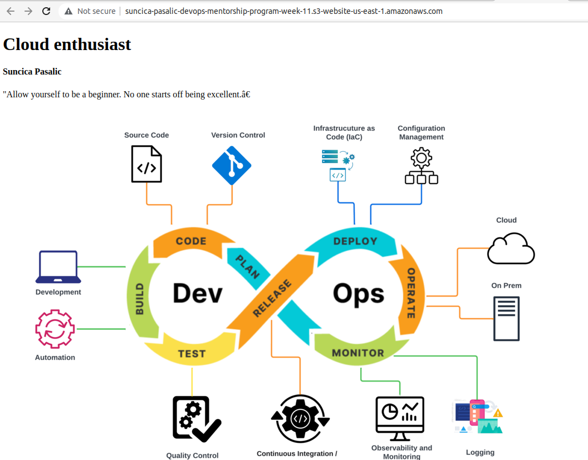
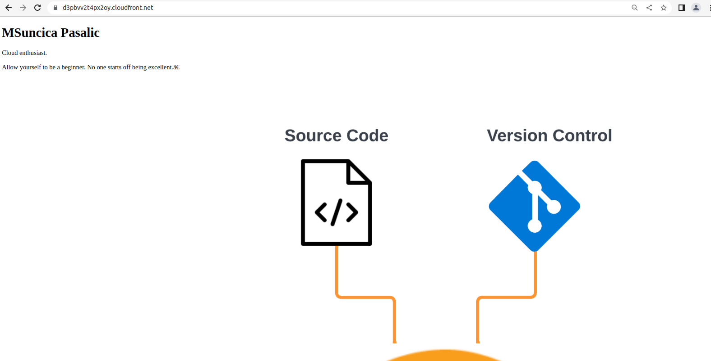

1. Kreiran bucket: 

Omogucavanje static website: 

Properties -> Static website hosting -> Enable

Permissions -> Public access

1. Bucket policy

Dodati bucket policy da je pristup samo fajlovima u bucket s nasim web fajlovima.

3. CLoud Front postavke 

Postavke origin: S3 website endpoint 
Name: ostaviti po defaultu
Viewer: Redirect HTTP to HTTPS

**Custom SSL certificate -> Request certificate**

**Request certificate: (potrebno importovati cert)**

**Import certificate using keys**

 
Screenshots: 

1. Bucket files:suncica-pasalic-devops-mentorship-program-week-11.s3-website-us-east-1.amazonaws.com

2. S3 endopint:

3.CloudFront endpoint: https://d3pbvv2t4px2oy.cloudfront.net

