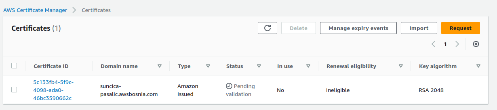

1. Kreiran bucket: 

Omogucavanje static website: 

Properties -> Static website hosting -> Enable

Permissions -> Public access

1. Bucket policy

Dodati bucket policy da je pristup samo fajlovima u bucket s nasim web fajlovima.

3. CLoud Front postavke 

Postavke origin: S3 website endpoint 
Name: ostaviti po defaultu
Viewer: Redirect HTTP to HTTPS

**Custom SSL certificate -> Request certificate**

**Request certificate:**

**Status pending - cekanje AWS da odobri custom certifiakt za domenu: suncica-pasalic.awsbosnia.com**

Screenshots: 

1. Bucket files:

2. S3 endopint

3.CloudFront endpoint: 

