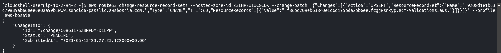
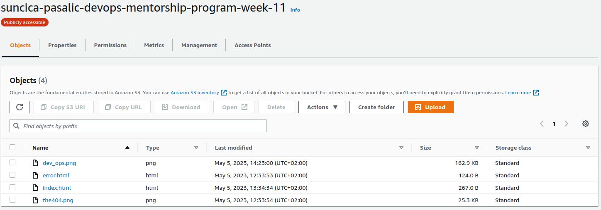

**1. Kreiran bucket:** 

Omogucavanje static website: 

Properties -> Static website hosting -> Enable

Permissions -> Public access

**2. Bucket policy**

Dodati bucket policy da je pristup samo fajlovima u bucket s nasim web fajlovima.

**3. CLoud Front postavke**

Postavke origin: S3 website endpoint 

Name: ostaviti po defaultu

Viewer: Redirect HTTP to HTTPS

Alternate domain name (CNAME) - optional: www.suncica-pasalic.awsbosnia.com (nakon registracije domene)

Custom SSL certificate - optional: certifikat koji kreiramo za domenu www.suncica-pasalic.awsbosnia.com

**4. Custom SSL certificate -> Request certificate**

**5. Request certificate:**

**6. Nakon request za public CA, potrebno je kroz CLI unijeti CName i CValue sa CA (pending status)**

**7. Aktivacija CA kroz CLI, nakon sto bude issued**

Komanda za aktivaciju: 

    aws route53 change-resource-record-sets --hosted-zone-id Z3LHP8UIUC8CDK --change-batch '{"Changes":[{"Action":"UPSERT","ResourceRecordSet":{"Name":"_9208d1e1b63d79839aba6aee0e0aa99b.www.suncica-pasalic.awsbosnia.com.","Type":"CNAME","TTL":60,"ResourceRecords":[{"Value":"_f86bd209eb63840e1c6d195bda2bb6ee.fcgjwsnkyp.acm-validations.aws."}]}}]}' --profile aws-bosnia

**Note:** Profile aws-bosnia se konfigurisao kroz CLI (aws configure --profile aws-bosnia kroz Access i Secret Keys)

CName:_9208d1e1b63d79839aba6aee0e0aa99b.www.suncica-pasalic.awsbosnia.com. (umjesto Name u CLI)
CValue:_f86bd209eb63840e1c6d195bda2bb6ee.fcgjwsnkyp.acm-validations.aws.   (umjesto Value)

**8. Kreiranje novog CA za domenu www.suncica-pasalic.awsbosnia.com**

**9. Import CA u CloudFront distribuciju**

**10. Registracija domene kroz R53 i enkriptovana domena**

Bilo je potrebno konfigurisati Route 53 kroz CLI koristeci komandu: 

    # Route 53 configuration:
    `aws route53 change-resource-record-sets --hosted-zone-id Z3LHP8UIUC8CDK --change-batch '{"Changes":[{"Action":"CREATE","ResourceRecordSet":{"Name":"www.suncica-pasalic.awsbosnia.com","Type":"CNAME","TTL":60,"ResourceRecords":[{"Value":"dx39mvrn0fan7.cloudfront.net"}]}}]}'` 

A nakon ove komande provjeriti DNS propagation: 

    # To check DNS propagation:
    `aws route53 list-resource-record-sets --hosted-zone-id Z3LHP8UIUC8CDK | jq '.ResourceRecordSets[] | select(.Name == "www.suncica-pasalic.awsbosnia.com.") | {Name, Value}'`

Međutim to nije bilo moguce nakon svih postavki lokalno preko CLI, a kasnije i u AWS CLoudShell, nakon cega se morao uraditi troubleshooting sa kolegom Orhanom Pojskić. 
Rjesenje problema se nalazi na linku -> [troubleshooting](troubleshooting-domene-https.md) R53 i registracija .

Screenshots: 

1. Link na [S3 Bucket files](suncica-pasalic-devops-mentorship-program-week-11.s3-website-us-east-1.amazonaws.com)

2. Link na [S3 endopint](http://suncica-pasalic-devops-mentorship-program-week-11.s3-website-us-east-1.amazonaws.com/)

3.Link na [CloudFront endpoint](https://d3pbvv2t4px2oy.cloudfront.net)

4. Link na [R53 endpoint -encrpyted](https://www.suncica-pasalic.awsbosnia.com/)

Dodatno: 

1. Link na [troubleshooting](troubleshooting-domene-https.md) R53 i registracija domene

2. Detaljniji koraci za ovaj task na linku [aleksandra-step-by-step](https://github.com/AleksandraLj/aleksandra-ljuboje-devops-mentorship/blob/main/week-10/Task-9-steps.md)