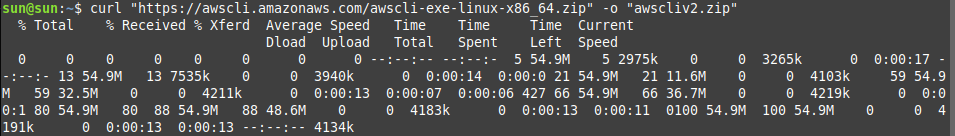
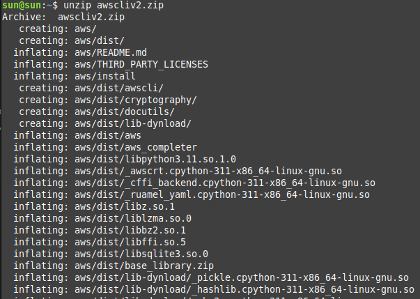
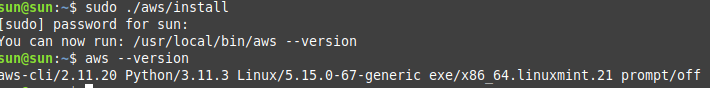

1. AWS Documentation: [Install or updating the latest version of the AWS CLI](https://docs.aws.amazon.com/cli/latest/userguide/getting-started-install.html)

### Install or update the AWS CLI

To update your current installation of AWS CLI, download a new installer each time you update to overwrite previous versions. 

        curl "https://awscli.amazonaws.com/awscli-exe-linux-x86_64.zip" -o "awscliv2.zip"
        unzip awscliv2.zip
        sudo ./aws/install

**UPDATE CURRENT CLI:** 

To update your current installation of the AWS CLI, add your existing symlink and installer information to construct the install command with the --update parameter.

        sudo ./aws/install --bin-dir /usr/local/bin --install-dir /usr/local/aws-cli --update

**UNZIP INSTALLER**

        unzip awscliv2.zip

**RUN THE INSTALL PROGRAM**

Run the install program. The installation command uses a file named install in the newly unzipped aws directory. By default, the files are all installed to /usr/local/aws-cli, and a symbolic link is created in /usr/local/bin. The command includes sudo to grant write permissions to those directories.

        sudo ./aws/install

**CONFIRM INSTALLATION**

        aws --version