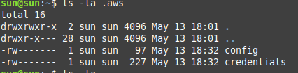
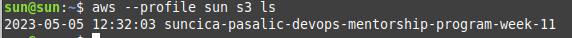

1. Kreiranje Access Keys za IAM usera (preko AWS Managament Console)

    Aleksandra Lj. je opisala ovaj postupak u svom fajlu [kreiranje i koristene access keys](https://github.com/AleksandraLj/aleksandra-ljuboje-devops-mentorship/blob/main/week-9/AccessKey.md)

2. Download lokalno zbog potrebnih podataka za keys pri konfiguraciji profila 
   

3. Konfiguracija profila (ime profila moze da bude kako zelite- samo da se zna za koji AWS account je podesen CLI)

         aws configure --profile sun

    **Ime profila: sun**

    Nakon ove komande pojavljuje se unos Access Keys i Secret keys koje unosite sa svog IAM accounta (access i secret keys). 

4. **AWS CLI profili:**

        aws configure list-profiles

5. **Mjesto u kojem se nalaze credentials i config fajl CLI:**

        ls -la .aws

6. **Koristenje profila na AWS CLI**
7. 
    

    Primjer ispisa S3 bucketa koristeci komandu: 

            $ aws --profile sun s3 ls 
        
    