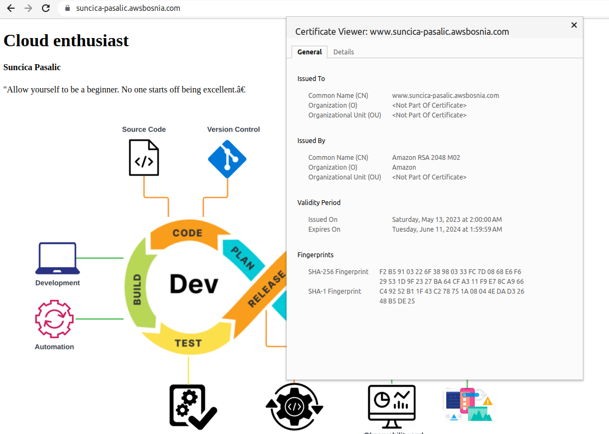

## PROBLEM pri kreiranju registrovanju domene www.suncica-pasalic.awsbosnia.com

Link na task9: https://github.com/allops-solutions/devops-aws-mentorship-program/issues/63

1. Bilo je potrebno u zadnjem koraku registrovati kroz CLI registrovati domenu www.suncica-pasalic.awsbosnia.com, međutim to nije bilo moguce. 

    a) **Konfigurisan profil aws-bosnia koristeci komandu (aws configure --profile aws-bosnia)**
        
        [cloudshell-user@ip-10-2-82-48 ~]$ aws configure list-profiles 
        aws-bosnia

    b) **Pokusaj kreiranja domene www.suncica-pasalic.awsbosnia.com uz pomoc profila aws-bosnia(ERROR)**

        [cloudshell-user@ip-10-2-82-48 ~]$ aws route53 change-resource-record-sets --hosted-zone-id Z3LHP8UIUC8CDK --change-batch '{"Changes":[{"Action":"CREATE","ResourceRecordSet":{"Name":"www.suncica-pasalic.awsbosnia.com","Type":"CNAME","TTL":60,"ResourceRecords":[{"Value":"dx39mvrn0fan7.cloudfront.net"}]}}]}' --profile aws-bosnia

        An error occurred (InvalidChangeBatch) when calling the ChangeResourceRecordSets operation: [Tried to create resource record set [name='www.suncica-pasalic.awsbosnia.com.', type='CNAME'] but it already exists]
    
    c) **Koristenje akcije "UPSERT" umjesto akcije "CREATE"   (OK)**

        [cloudshell-user@ip-10-2-82-48 ~]$ aws route53 change-resource-record-sets --hosted-zone-id Z3LHP8UIUC8CDK --change-batch '{"Changes":[{"Action":"UPSERT","ResourceRecordSet":{"Name":"www.suncica-pasalic.awsbosnia.com","Type":"CNAME","TTL":60,"ResourceRecords":[{"Value":"dx39mvrn0fan7.cloudfront.net"}]}}]}' --profile aws-bosnia
        {
            "ChangeInfo": {
        "Id": "/change/C0821354C1YBTMZP69V3",
        "Status": "PENDING",
        "SubmittedAt": "2023-05-15T13:11:51.508000+00:00"
            }
        }

    d) **Provjera DNS propagation (ERROR)**

        [cloudshell-user@ip-10-2-82-48 ~]$ aws route53 list-resource-record-sets --hosted-zone-id Z3LHP8UIUC8CDK | jq '.ResourceRecordSets[] | select(.Name == "www.suncica-pasalic.awsbosnia.com") | {Name, Value}' --profile aws-bosnia
        jq: Unknown option --profile
        Use jq --help for help with command-line options,
        or see the jq manpage, or online docs  at https://stedolan.github.io/jq

        An error occurred (AccessDenied) when calling the ListResourceRecordSets operation: User: arn:aws:iam::xxxxxxxxxxxx:user/suncica.pasalic is not authorized to access this resource

## PROBLEM - SOLVED uz pomoc kolege Orhana Pojskica, na sljedeci nacin: 

a) AWS CLoudShell-u smo koristili sudo su komandu i konfigurisali profil aws configure bez --profile aws-bosnia

b)Nakon konfiguracije profila, probali smo ispisati DNS rekorde uz pomoc komande: 

    aws route53 list-resource-record-sets --hosted-zone-id Z3LHP8UIUC8CDK

 I to je proslo uspjesno, gdje smo vidjeli DNS zapis i uslikala svoj DNS zapis.

 **Note:** Pregled DNS zapisa - **SPACE** za listanje, a na kraju pronadjenog DNS zapisa koristimo **q** za prekid.

c) Probali smo komandu za konfiguraciju R53 kroz CLI

    aws route53 change-resource-record-sets --hosted-zone-id Z3LHP8UIUC8CDK --change-batch '{"Changes":[{"Action":"UPSERT","ResourceRecordSet":{"Name":"www.suncica-pasalic.awsbosnia.com.","Type":"CNAME","TTL":60,"ResourceRecords":[{"Value":"dx39mvrn0fan7.cloudfront.net"}]}}]}'

Dobili odgovor: 

    -bash-4.2# aws route53 change-resource-record-sets --hosted-zone-id Z3LHP8UIUC8CDK --change-batch '{"Changes":[{"Action":"UPSERT","ResourceRecordSet":{"Name":"www.suncica-pasalic.awsbosnia.com.","Type":"CNAME","TTL":60,"ResourceRecords":[{"Value":"dx39mvrn0fan7.cloudfront.net"}]}}]}'
    {
    "ChangeInfo": {
        "Id": "/change/C05967402ZK3PBVIIR9F",
        "Status": "PENDING",
        "SubmittedAt": "2023-05-15T14:11:04.301000+00:00"
        }
    }
d)
    Provjerili CloudFront postavke:

       CloudFront -> ID distribucije (kliknuli) -> Settings -> Edit -> Alternate Domain Name -> www.suncica-pasalic.awsbosnia.com -> Save Changes

Nakon sto je zavrsen Deploying promjena, pristupila sam domeni www.suncica-pasalic.awsbosnia.com i sve je radilo, a bilo je enkriptovano sto se i moze vidjeti na osnovu screenshoot.

